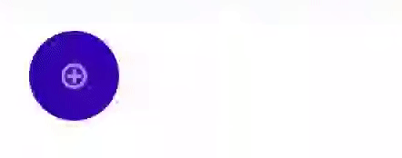
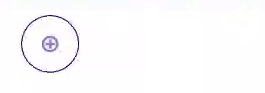
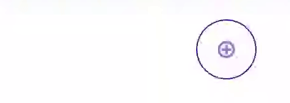

# Android UI Expandable Button

This is the expandable button which can switch the button between "icon only" and "icon and text" state.

The design of the button is following the material design guideline.

[https://material.io/components/buttons](https://material.io/components/buttons)

#### Show case

|---|Align Start|Default/Align Center|Align End|
|---|---|---|---|
|Solid||||
|Outline||||

#### Documentation

The following code sample shows a typical use, with an XML layout and code to modify the contents of the text view:

```
<com.codedeco.lib.ui.widget.button.ExpandableButton
    android:icon="@android:drawable/ic_menu_add"
    android:layout_height="wrap_content"
    android:layout_width="wrap_content"
    android:text="add entry"
    android:textColor="#FFFFFFFF"
    android:tint="#FF3700B3"
    app:iconTint="#FFFFFFFF" />
```

```
val button: ExpandableButton = findViewById(R.id.button)
button.apply {
    icon = context.getDrawable(android.R.drawable.ic_menu_add)
    iconTint = Color.WHITE
    text = "add entry"
    textColor = Color.WHITE
    tint = Color.parseColor("#FF3700B3")
} 
```

Anchor of the ExpandableButton is based on the alignment to the parent

Examples

```
<LinearLayout
    android:layout_width="match_parent"
    android:layout_height="wrap_content"
    android:orientation="vertical">
    <!-- Align to start, anchor is start of the button -->
    <ExpandableButton
        android:layout_width="wrap_content"
        android:layout_height="wrap_content"
        android:layout_gravity="start"/>
        
    <!-- Align to center, anchor is middle of the button -->
    <ExpandableButton
        android:layout_width="wrap_content"
        android:layout_height="wrap_content"
        android:layout_gravity="center"/>
        
    <!-- Align to end, end is start of the button -->
    <ExpandableButton
        android:layout_width="wrap_content"
        android:layout_height="wrap_content"
        android:layout_gravity="end"/>
</LinearLayout>
```
```
<androidx.constraintlayout.widget.ConstraintLayout
    android:layout_width="match_parent"
    android:layout_height="wrap_content">
    <!-- Align to start, anchor is start of the button -->
    <ExpandableButton
        android:layout_width="wrap_content"
        android:layout_height="wrap_content"
        app:layout_constraintStart_toStartOf="parent"/>
        
    <!-- Align to center, anchor is middle of the button -->
    <ExpandableButton
        android:layout_width="wrap_content"
        android:layout_height="wrap_content"
        app:layout_constraintStart_toStartOf="parent"
        app:layout_constraintEnd_toEndOf="parent"/>
        
    <!-- Align to end, end is start of the button -->
    <ExpandableButton
        android:layout_width="wrap_content"
        android:layout_height="wrap_content"
        app:layout_constraintEnd_toEndOf="parent"/>
</LinearLayout>
```

###### XML attributes

|Attribute Name|Format|Description|Default Value|
|---|---|---|---|
|strokeWidth|dimension|Width of button border|0dp|
|strokeColor|reference\|color|Color of button border|null|
|android:tint|reference\|color|Color of button background|depends on the theme|
|android:icon|reference|Icon of button|null|
|iconTint|reference\|color|Color of button icon|depends on the theme|
|android:text|reference\|text|Text of button|null|
|android:textColor|reference\|color|Text color of button|depends on the theme|
|android:textStyle|normal\|bold\|italic|Text style of button|normal|
|fadeIn|boolean|Fade in when the button display on the screen|false|
|scaleIn|boolean|Scale in when the button display on the screen|false|
|android:animationDuration|integer|Animation time in millisecond of fade in, scale in, expand and collapse|300|
|expanded|boolean|Default button statue|false|

###### Public Properties
|Property|Data Type|Nullable|Read|Write|Description|Default Value|
|---|---|:-:|:-:|:-:|---|---|
|isExpanded|Boolean|×|✓|×|Expand state of the button|false|
|strokeWidth|Int|×|✓|✓|Width of button border|0|
|strokeColor|ColorStateList|✓|✓|✓|Color of button border|null|
|tint|ColorStateList|✓|✓|✓|Color of button background|depends on the theme|
|icon|Drawable|✓|✓|✓|Icon of button|null|
|iconTint|ColorStateList|✓|✓|✓|Color of button icon|depends on the theme|
|text|String|✓|✓|✓|Text of button|null|
|textColor|ColorStateList|✓|✓|✓|Text color of button|depends on the theme|
|textStyle|Int|×|✓|✓|Text style of button|Typeface.NORMAL|
|fadeIn|Boolean|×|✓|✓|Fade in when the button display on the screen|false|
|scaleIn|Boolean|×|✓|✓|Scale in when the button display on the screen|false|
|animationDuration|Long|×|✓|✓|Animation time in millisecond of fade in, scale in, expand and collapse|300|

###### Public Methods

|Method|Description|
|---|---|
|show(): Unit|Show the button after attributes are set.|
|setExpanded(isExpanded: Boolean): Unit|Set the expand status of the button.|

#### Use in Recycler View

If you want to use this button in recycler view, you have to call `show()` function in `fun onBindViewHolder(holder: RecyclerView.ViewHolder, position: Int)`

Here is the example
```
class MyAdapter: RecyclerView.Adapter<RecyclerView.ViewHolder>() {
   ...
   fun onBindViewHolder(holder: RecyclerView.ViewHolder, position: Int) {
       if (holder is MyViewHolder) {
           holder.findViewById<ExpandableButton>(R.id.expandable_button).apply {
               text = "Button $i"
               // You have to call show() after you changed any properties of the button
               show()
           }
       }
   }
   ...
}
```

#### Integration Guideline

1. Include the module [lib-ui](lib-ui) into your project.
2. Include the UI element that mentioned at the top of the README.md

#### Notes
- ExpandableButton attach LayoutTransition to the container ViewGroup. If you don't want to have LayoutTransition for other views, please add extra container view to wrap the ExpandableButton
- If the width of container view is smaller than the width of expanded ExpandableButton, you will see the ExpandableButton jumps / clipped. Please make sure your container view has enough size

#### Known Issues

- According to the MaterialButton from material design library, it doesn't support very long button text
